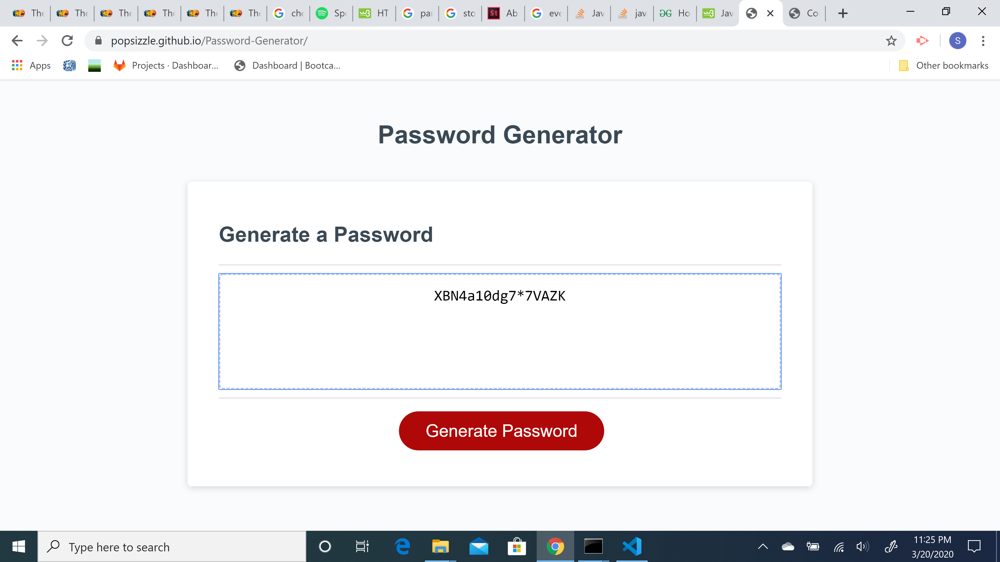

# Password Generator

This site has been created to help users generate passwords. It allows for specifications to be entered which dictate password length and which characters are to be used in the passwords generated. It will generate random passwords each time according to the guidelines and print them on the screen.

## Ease of use

This password generator is made to be easy to use and intuitive for the user. The simple layout and instructive prompts allow them to create whatever password is needed to suit their needs.

### Use of functions

The construction of the javascript for this site required the use of a variety of functions and then chaining them together so that they would operate in the correct sequence. Here is an example of two of those functions:

// function for finding random index in any array

function randomIndex(array){
  return Math.floor(Math.random()*array.length);
}

// function for randomly creating password from the 

charArray
function createPassword(){
  for(i=0; i<passLength; i++){
    var array1 = charArray[randomIndex(charArray)];
    var randomChar = array1[randomIndex(array1)];
    newPassword += randomChar;
  }
}

## Built With

* [HTML](https://developer.mozilla.org/en-US/docs/Web/HTML)
* [CSS](https://developer.mozilla.org/en-US/docs/Web/CSS)
* [Javascript](https://developer.mozilla.org/en-US/docs/Web/JavaScript)

## Deployed Link

* [https://popsizzle.github.io/Password-Generator/](#)

## Author

* **Sam Poppe** 

- [https://popsizzle.github.io/Responsive-Portfolio/]
- [https://github.com/PopSizzle]
- [https://www.linkedin.com/in/sam-poppe-623281193/]

## Acknowledgments

* Special thanks to Michael Downs for the idea to use a while loop while prompting for password length!

